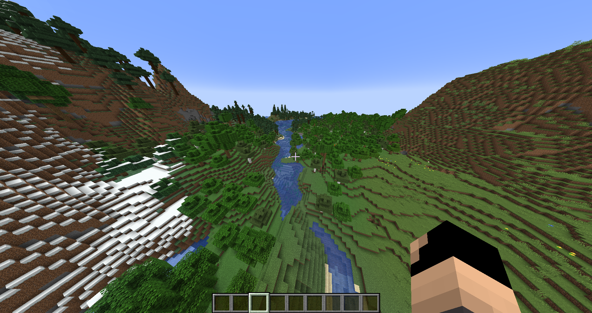
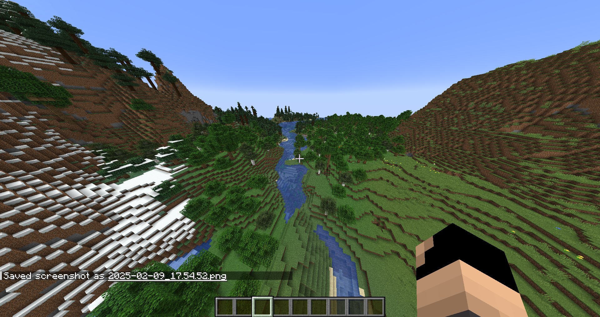

# Current Validators
## AnyNamespacePresentValidator
Checks if the resource pack has a namespace folder (e.g. assets/**minecraft**). Although it's not required to have a namespace folder, it's most likely what you want.

  
Failing Examples

  <ul>
    <li>empty folder</li>
    <li>folder with only <code>pack.png</code></li>
    <li>folder with only <code>pack.mcmeta</code></li>
  </ul>

## ModelIsJsonObjectValidator
Checks if all json files located in a namespaces models directory are JsonObjects. This is a basic check, which should never fail, but it's a requirement for all other model based checks.

  
Failing Examples

  <ul>
    <li>Json Arrays <code>[…]</code></li>
    <li>Json Primitives <code>"…"</code></li>
  </ul>

## ModelParentValidator
Checks if a model has a valid parent, the parent needs to be inside the same resource pack or referencing a vanilla model. This check does not fail if no parent is set.

  
Failing Examples

  <ul>
    <li> 
<pre lang="json">{
    "parent": "minecraft:item/not_existing",
    "someKey": "someValue"
}</pre> 
    In this example the parent model referencing another model file which is not part of the current resource pack or a vanilla model
    </li>
    <li> 
<pre lang="json">{
    "parent": {
        "someKey": "someValue"
    },
    "someKey": "someValue"
}</pre> 
    In this example the parent model is not a string
    </li>
  </ul>

## ModelHasAnyTextureValidator
Checks if a model has at least one texture assigned to it. This check does not fail if the model has an existing parent model.

  
Failing Examples

  <ul>
    <li> 
<pre lang="json">{
    "display": {
        "someKey": "someValue"
    }
}</pre> 
    In this example the model does not have the textures map set and has no parent: This makes the model not having any textures
    </li>
        <li> 
<pre lang="json">{
    "textures": [
        "someValue"
    ],
    "display": {
        "someKey": "someValue"
    }
}</pre> 
    In this example the model has the textures field, but it is not a JSON object, it's a JSON array
    </li>
            <li> 
<pre lang="json">{
    "textures": [
        "particle": "minecraft:item/clay_ball"
    ],
    "display": {
        "someKey": "someValue"
    }
}</pre> 
    In this example the model has textures, but only the particles texture, this may not be invalid, but it is most likely not wanted
    </li>
  </ul>

## ModelTexturesExistsValidator
Checks if the texture files referenced in the model exists.

  
Failing Examples

  <ul>
    <li> 
<pre lang="json">{
    "textures": {
        "all": "minecraft:item/not_existing"
    },
    "display": {
        "someKey": "someValue"
    }
}</pre> 
    In this example the model binds the texture with the key <code>all</code> to an image which does not exist, as there is no image located at the path <code>assets/minecraft/textures/item/not_existing.png</code>
    </li>
  </ul>

## ModelTextureReferencesResolvableValidator
Checks if all hashprefixed referenced textures (e.g. #side) are bound to a texture. This validation is skipped if the file is used as a parent in any other model to allow template models.

  
Failing Examples

  <ul>
    <li> 
<pre lang="json">{
    "textures": {
        "one": "#not_existing",
        "another": "minecraft:item/clay_ball"
    },
    "display": {
        "someKey": "someValue"
    }
}</pre> 
    In this example the model binds the texture with the key <code>one</code> to a reference <code>#not_existing</code> which does not exist in any parent or child model
    </li>
    <li> 
<pre lang="json">{
    "textures": {
        "one": "#another",
        "another": "#one"
    },
    "display": {
        "someKey": "someValue"
    }
}</pre> 
    In this example the model binds the texture with the key <code>one</code> to a reference <code>#another</code> which binds the texture back again to the reference <code>#one</code> which would cause an infinite loop
    </li>
    <li>This validator also fails if the model is used a template model, but has no children, which defined it as parent</li>
    <li>This validator also fails if the model is the 10th parent</li>
  </ul>

## ModelOverridesExistsValidator
Checks if item overrides are correct and the referenced model exists.

> [!NOTE]  
> This validator only takes model overrides from before 1.21.4 into account (not the new item definitions inside the items subfolder)

  
Failing Examples

  <ul>
    <li> 
<pre lang="json">{
  "parent": "minecraft:item/generated",
  "textures": {
    "someKey": "someValue"
  },
  "overrides": [
    {
      "predicate": {
        "custom_model_data": 1
      },
      "model": "some/path/not_existing"
    }
  ]
}</pre> 
    In this example the override references a model path, which can not be resolved to a model json (e.g. the file does not exist or is located wrongly)
    </li>
  </ul>

## UnusedFileValidator
Checks every file if it has been referenced in any json file. Most files need to be referenced somewhere, but this check may falsely detect files, which are in use. This will not flag for vanilla texture/model overrides. Files can be ignored with the `ignore` option using shell globs or regex.

> [!NOTE]  
> This validator may have many false-positives and false-negatives

## TextureLimitMipLevelValidator
Checks every PNG file, that will be loaded into the texture atlas, if it limits the mipmap levels. If the mip level drops below 4, the game displays certain textures with lower quality (e.g. leaves).

  
Details

  Whenever a texture is loaded, which does not respect the texture sizes required for mip mapping, it may drop the usable mip level. For mip mapping to work (for mip map level 4) you need to have a texture size of at least 16x16, height and width should be divisible by 16 without a remainder. For comparison: Here are two screenshots with mip level 0 and mip level 4 (differences mostly notable on distant leaves):  
  Mip Level 4: 
    
  Mip Level 0: 
  

  
Fixing textures

  To fix textures that do limit the mip level, you simply need to adjust their size to be divisible by 16 without remainder. This may also involve changing the model files for UV mapping.

## TextureIsNotCorruptedValidator
Checks every PNG file, that is located in any resource pack directory, if the texture is an actual image.

## FontTextureExistsValidator
Checks if the texture file referenced in the font provider exists.

  
Failing Examples

  <ul>
    <li> 
<pre lang="json">{
  "providers": [
    {
      "type": "bitmap",
      "file": "some/path/not_existing.png",
      "ascent": 4,
      "height": 10,
      "chars": [
        "\uE000"
      ]
    }
  ]
}</pre> 
    In this example the font provider references a texture which does not exist.
    </li>
  </ul>

## FontCharacterUsageValidator
Checks if a font file defines a character multiple times, which overrides the character.

  
Failing Examples

  <ul>
    <li> 
<pre lang="json">{
  "providers": [
    {
      "type": "bitmap",
      "file": "some/path/file1.png",
      "ascent": 4,
      "height": 10,
      "chars": [
        "\uE000"
      ]
    },
    {
      "type": "bitmap",
      "file": "some/path/file2.png",
      "ascent": 4,
      "height": 10,
      "chars": [
        "\uE000"
      ]
    }
  ]
}</pre> 
    In this example the font provider references the same character twice, which would override the character.
    </li>
  </ul>

## InvalidPathValidator
Checks if a namespace or resource path violates the allowed pattern: [a-z0-9-_.] (for namespaces) and [a-z0-9-_./] for paths. 

## ModelRequiresOverlayOverrideValidator
Checks if a model json, which is present in the default pack, is also present in a specified overlay. This Validator requires some additional configuration to run and may be used to make sure every model in a specified path is overridden in a specific overlay (e.g. to fix certain models in certain game versions). Take a look at the [config file](CONFIG.md) for more details on how to configure this validator.